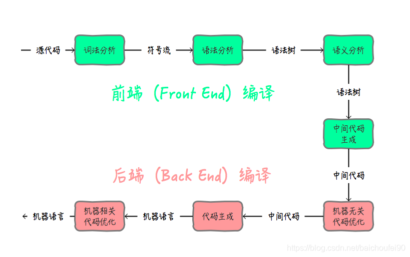

# SysY 编译器 2025编译系统实现赛参赛项目

此为2025年计算机系统能力大赛编译系统实现赛，老师菜菜捞捞队的参赛项目。 项目使用C++语言实现了一个SysY语言到RISC-V后端的编译器。

项目地址：https://gitlab.eduxiji.net/T202510055206450/compiler2025-lsccll

## 关于运行此项目

需要的外部依赖：
1. flex
2. bison

运行以下命令，以获取并编译此项目，并使用此编译器编译SysY语言到RISC-V汇编代码。
```
git clone https://gitlab.eduxiji.net/T202510055206450/compiler2025-lsccll
cd compiler2025-lsccll/
make
./bin/compiler -S -o output_file_path input_file_path -O1
```

其中`-S`可修改为`-llvm`以生成LLVM IR而非RISC-V汇编代码，去除`-O1`或修改为`-O0`以关闭优化。

或者在编译此项目后，运行以下命令来使用自动化脚本完成测试。

```
python3 test.py  input_case_folder  output_folder  1 S
```


## 关于此编译器的设计

### 项目架构
```
./
|——─ include //头文件
|       |—— ast //语法树相关
|       |     └ ......
|       |—— backend //riscv后端相关
|       |    └ ......
|       |—— common 
|       |    |—— array //关于数组索引转换 
|       |    |—— type //关于语法树中数据类型，符号表等
|       |    |      |—— symtab //符号表定义
|       |    |      |—— type_defs.h
|       |    |      |—— type_calc.h
|       |    |——str_convert.h //词法分析时字符串值的计算
|       |
|       |—— llvm_ir //关于中间代码生成
|       |    |—— instructions.h //中间代码指令定义
|       |    |—— ...... //其他结构定义
|       |       
|       |—— parser //关于词法语法分析
|       |    |—— ......
|       |—— str //关于打印语法树
|
│———— lib
|
|———— optimize //关于优化
|       |—— llvm //中端优化
|       |     |—— ......
|       |——......
|———— parser
|       |—— lexer.l //词法分析
|       |—— yacc.y //语法分析
|
|———— src // 头文件中定义的实现 结构同include
|       |—— ......
| 
|———— utils //辅助代码
|       |—— ......
|
|———— Makefile
|———— main.cpp
|———— test.py
└─——— ......
```

### 编译流程



#### 1、词法分析
在词法分析阶段，编译器需要实现输入字符流到token流的转换。

本项目中，我们使用flex完成词法分析。flex 用于根据正则表达式规则生成 C 语言词法分析器代码，这些代码可以自动识别特定的词法单元（tokens），如关键词、标识符、数字、运算符等。我们编写.l文件（本项目中`/parser/lexer.l`）描述要识别的SysY语法规则，并使用flex命令生成对应C++代码（本项目中`/src/parser/lexer.cpp`）。

#### 2、语法分析
在语法分析阶段，编译器需要通过输入的token流匹配产生式，产生式的语义动作创建语法树节点并连接，实现由输入token流构造语法树。

本项目中，我们使用bison完成语法分析，bsion接收来自flex的token流，根据定义的语法规则进行语法分析并构建语法树或执行语义动作，生成一个 LALR(1) 语法分析器。我们编写.y文件（本项目中`/parser/yacc.y` ），描述要识别的产生式和语义动作。

我们语法树的设计如下：
```
class Node
{
  public:
    int           line_num;
    NodeAttribute attr;

  public:
    Node(int line_num = -1);
    virtual ~Node();

    virtual void printAST(std::ostream* oss, const std::string& prefix = "", bool isLast = true) = 0;
    virtual void typeCheck()                                                                     = 0;
    virtual void genIRCode()                                                                     = 0;

    void set_line(int line_num);
    int  get_line() const;
};

class ASTree : public Node
{
  private:
    std::vector<StmtNode*>* stmts;

  public:
    ASTree(std::vector<StmtNode*>* stmts = nullptr, int line_num = -1);
    virtual ~ASTree();

    void printAST(std::ostream* oss, const std::string& prefix = "", bool isLast = true) override;
    void typeCheck() override;

    void handleGlobalVarDecl(VarDeclStmt* decls);
    void genIRCode() override;
};
```
其中`printAST()` `typeCheck()` `genIRCode()`为打印语法树、语义分析、中间代码生成的自顶向下的递归接口，其在实现时调用子节点的同名函数，因此调用根节点的这些函数即可完成打印语法树（进行调试），语义分析，中间代码生成工作。

下面是本项目中使用bison完成语法分析的一个例子，其对应SysY文法中AddExp的产生式`AddExp -> MulExp | AddExp('+''-')MulExp`。

```
ADDSUB_EXPR:
    MULDIV_EXPR {
        $$ = $1;
    }
    | ADDSUB_EXPR PLUS MULDIV_EXPR {
        $$ = new BinaryExpr(OpCode::Add, $1, $3);
    }
    | ADDSUB_EXPR MINUS MULDIV_EXPR {
        $$ = new BinaryExpr(OpCode::Sub, $1, $3);
    }
    ;
```

当匹配到产生式右边为乘除模表达式时，加减表达式的语法树节点同乘除模表达式的节点。

当匹配到产生式右边为加减表达式与乘除模表达式的运算时，即new一个新的二元运算语法树节点，左右孩子分别为匹配到的两个表达式语法树节点的指针。


#### 3、语义分析

在语义分析阶段，编译器接收语法树作为输入，输出经过检查和预处理的语法树。

检查内容包括指令的数据类型是否匹配，是否存在除以0、变量重复定义、无main函数等不合法情况，对程序中不合法位置进行报错，并填充一些语法树中的节点属性。


#### 4、中间代码生成

在中间代码生成阶段，编译器接收语法树作为输入，输出LLVM IR中间代码指令流。相关的定义位于`/include/llvm_ir`文件夹下。

此处，LLVM IR是是一种平台无关、中间级别、静态单赋值（SSA）形式的指令集，本项目中选择LLVM IR作为中间表示，这是出于以下几点考虑：

1. LLVM IR 与具体目标架构无关，支持通过不同后端生成多种体系结构的机器代码，使得此项目具有较好的多后端扩展性，而非仅限于RISC-V。

2. LLVM IR以Pass的形式组织优化，易于扩展和插拔优化组件，提升了项目的可维护性与实验灵活性。

3. LLVM 提供了丰富的中间代码优化 Pass，一方面，这些优化可以为此项目的优化提供参考；另一方面，使得我们可以将中端代码和后端代码进行分离，将本项目编译器的后端与clang的后端进行对比，进行更详细的profiling。

在实际的中间代码生成模块中，我们编写前面提到的`genIRCode()`语法树节点成员函数，生成LLVM IR到Block的Instruction中。我们Instruction的设计如下所示：

```
class Instruction
    {
      public:
        IROpCode    opcode;
        int         block_id;
        std::string comment;

        Instruction(IROpCode op = IROpCode::OTHER);
        virtual ~Instruction() = default;

        virtual void printIR(std::ostream& s) = 0;

        virtual void Rename(std::map<int, int>& replace) = 0;
        virtual void ReplaceAllOperands(std::map<int, int>& replace) = 0; 
        virtual int                   GetResultReg()     = 0;
        virtual std::vector<int>      GetUsedRegs()      = 0;
        virtual std::vector<Operand*> GetUsedOperands()  = 0;
        virtual Operand*              GetResultOperand() = 0;

        virtual Instruction* Clone(int new_result_reg = -1) const                             = 0;
        virtual void         SubstituteOperands(const std::map<int, Operand*>& substitutions) = 0;
        virtual DataType     GetResultType() const                                            = 0;
        virtual Instruction* CloneWithMapping(
            const std::map<int, int>& reg_map, const std::map<int, int>& label_map) const = 0;
        virtual std::vector<Operand*> GetCSEOperands() const                              = 0;

        std::string  toString();
        virtual void ReplaceLabels(const std::map<int, int>& label_map) = 0;
    };
```

IRBlock的设计如下所示，

```
class IRBlock
    {
      public:
        std::string comment;
        int         block_id;

        std::deque<Instruction*> insts;

        IRBlock(int id = 0);
        ~IRBlock();

        void printIR(std::ostream& s);

      public:
        void insertLoad(DataType t, Operand* ptr, int res_reg);
        void insertStore(DataType t, int val_reg, Operand* ptr);
        //......
        //若干其他指令插入接口
    };
```

#### 5、中间代码优化

在中间代码优化阶段，编译器接收生成的中间代码，经一系列处理，生成优化后的中间代码。

在本项目中，优化以Pass的形式组织，Pass的基类如下所示：
```
class Pass
{
  public:
    LLVMIR::IR*  ir;
    virtual void Execute() = 0;
    Pass(LLVMIR::IR* ir) { this->ir = ir; }
};
```
其中`ir`为此Pass要处理的中间代码指针，`Execute()`为Pass的统一执行接口。本项目的中间代码优化阶段完成了一系列涵盖数据流优化、控制流优化、循环优化、函数优化等多个方面的优化操作，相关代码位于`/optimize`文件夹，具体内容将在关于性能与优化一节中介绍。

#### 6、目标代码生成
在目标代码生成阶段，编译器接收经一系列中端优化后的中间代码，生成RISC-V后端代码。

目标代码生成部分主要包括指令选择与寄存器分配两部分，指令选择即为LLVM IR指令选择对应的RISC-V指令，以实现编译出实际后端平台上的代码，此时使用的寄存器仍然为虚拟寄存器。我们设计的RISC-V后端编译框架定义位于`/include/backend/rv64`，指令选择相关定义位于`/include/backend/rv64/selector.h`，其中，我们设计的rv64指令数据结构如下：

```
class RV64Inst : public Instruction
    {
      public:
        RV64InstType op;
        bool         use_label;
        int          imme;
        RV64Label    label;
        Register     rd, rs1, rs2, rs3;

        int call_ireg_cnt, call_freg_cnt;
        int ret_type;

      public:
        RV64Inst();

      public:
        std::vector<Register*> getReadRegs() override;
        std::vector<Register*> getWriteRegs() override;
        void                   replaceAllOperands(const std::map<int, int>& reg_replace_map) override;
        int                    getLatency() const;
    };
```

指令选择完毕后，对此时的目标代码进行寄存器分配，本项目中目前使用线性扫描方法完成寄存器的分配，此方法的思想为将变量的活跃区间看作一段连续的时间区间，然后用线性方式遍历所有变量的活跃区间，并贪心分配可用寄存器，如无空闲寄存器则将某些变量spill到内存。本本项目的寄存器分配算法定义于`/include/backend/rv64/reg_assign.h`。

以及，本项目在RISC-V后端也进行了一些机器相关代码优化，相关代码的定义分布于`/include/backend`文件夹下。

## 关于性能与优化

在本项目中，编译器的中端与后端分别实现了一系列优化 Pass，完成提升代码质量、减少冗余指令、增强循环性能、改善函数调用开销等功能，以生成更高效的目标代码。优化框架结构清晰，支持 Pass 插拔与分阶段调度，具备良好的扩展性与实践效果。

### 中端完成的优化

#### 基础优化（数据流与 SSA 构造）

- Mem2reg：将内存变量提升为 SSA 形式，建立统一的数据流框架  
- DCE：删除无用指令，减少冗余计算  
- ADCE：在控制流分析基础上进一步删除不可达或无效代码  
- CSE：识别并消除重复的子表达式，提升计算复用率  
- 稀疏条件常量传播（SCCP）：结合条件分支和数据流，实现精准的常量推导  
- GCM：将计算指令移动到控制流较少的位置，以提升执行效率
- 算术指令强度削弱：将乘法、GEP等高代价算术操作替换为加法、移位等低成本指令

#### 循环优化（Loop Optimization）

- 循环识别（Loop Find）：识别自然循环，构建循环森林结构  
- 循环规范化（Loop Simplify）：将循环转化为标准形式，便于后续分析与优化  
- LCSSA（Loop-Closed SSA）：将循环出口变量封闭在 Phi 节点中，确保 SSA 完整性  
- 循环不变量外提（LICM）：将不随循环迭代变化的指令移至循环外，减少重复执行  
- Loop Rotate：调整循环结构，使条件判断在循环尾，提高分支预测性能  
- SCEV：构建标量演化表达式，统一刻画归纳变量与循环边界  
- 归纳变量简化：将复杂递推变量化简为规范线性形式  
- 循环强度削弱：针对循环中的乘法与地址计算表达式，用加法替换，以降低其计算复杂度
- 常量迭代次数循环完全展开：在静态可知循环边界时展开循环体，消除分支与增益流水线性能

#### 函数级优化

- 函数内联（Inlining）：将被调用函数体插入调用点，减少调用开销，暴露优化机会  
- 尾递归优化（Tail Recursion Elimination）：将尾递归转化为循环，避免栈空间消耗


### 后端完成的优化

## 关于参考

https://github.com/yuhuifishash/SysY
